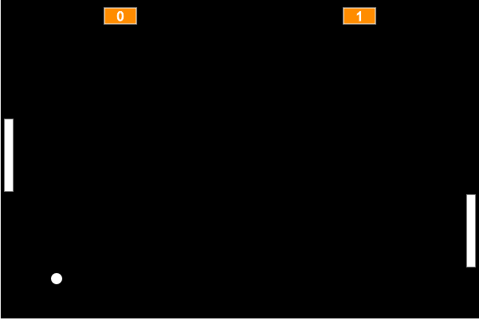

<h2>Pong Game</h2>

<h3>Techs:</h3>

     - JavaScript

<h3>About:</h3>

This game, was developed by Filipe, based on the Alura course about Classic Games Part.1!
 
  Made in pure JavaScript language, using the Web Editor <a href="https://p5js.org/">P5JS</a> with your library <a href="https://github.com/bmoren/p5.collide2D">p5.collide2D</a>

